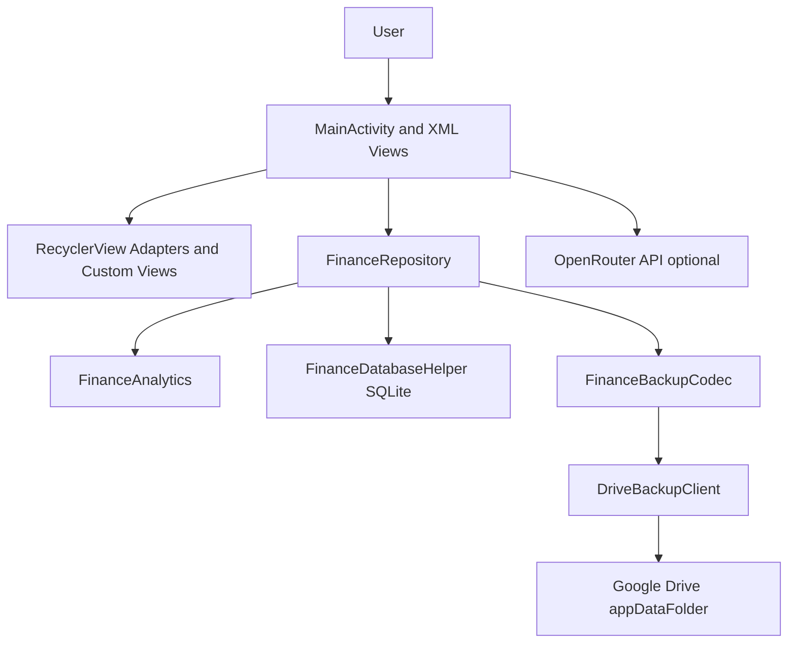
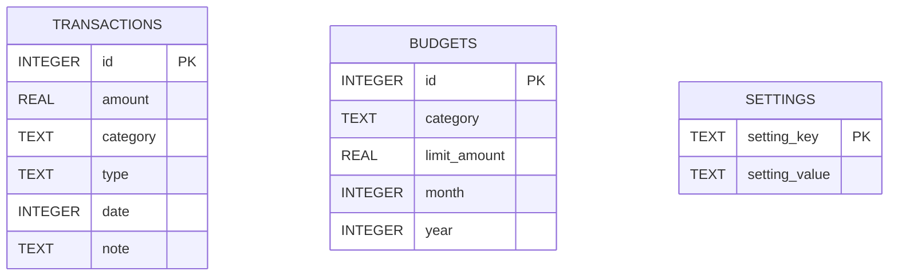
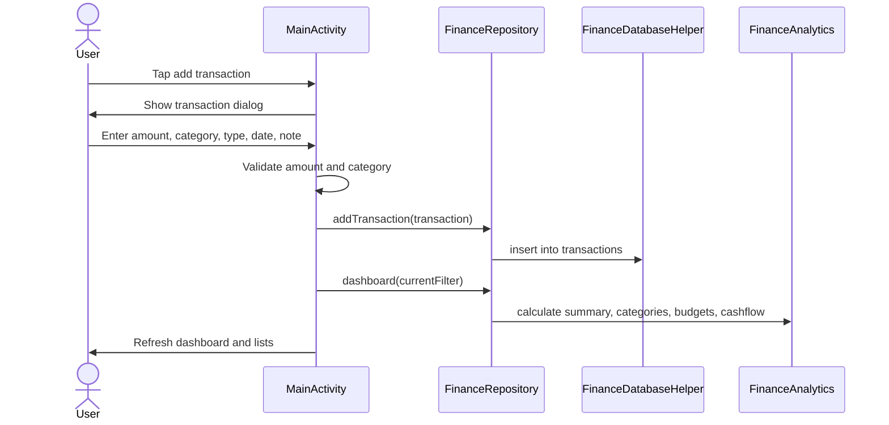
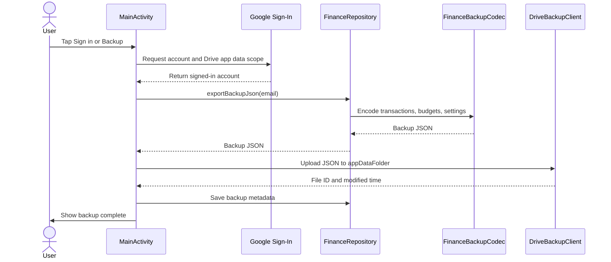

# Nexus Finance Project Documentation

Course: Software Development -III
Course ID : CSE 061 2212
Project: Nexus Finance  
Platform: Android  
Language: Kotlin  
UI Stack: XML Views with ViewBinding  
Last updated: May 3, 2026  

Prepared by:

- Student name: Sezan Mahmood
- Student ID: 100 241 005101 006
- Department: Computer Science & Engineering
- University: Khulna Khan Bahadur Ahsanullah University.
- Instructor: <a href="https://www.kkbau.ac.bd/departments/cse/musfiq-shahriar-shafi/"> Mushfiq Shahrier Shafi </a>
- Designation: Lecturer, Department of CSE & Proctor (In-charge)

## Table of Contents

1. Abstract
2. Introduction
3. Problem Statement
4. Objectives
5. Scope
6. Target Users
7. Existing System and Proposed System
8. Functional Requirements
9. Non-Functional Requirements
10. Technology Stack
11. System Architecture
12. Module Description
13. Database Design
14. Data Models
15. Main Workflows
16. User Interface Design
17. Analytics and Calculation Logic
18. Backup and Restore Design
19. AI Report Design
20. Security and Privacy
21. Error Handling
22. Testing Documentation
23. Build and Deployment Guide
24. Limitations
25. Future Enhancements
26. Conclusion
27. Appendix

## 1. Abstract

Nexus Finance is an Android-based personal finance management application designed for offline-first usage. It allows users to record income and expenses, analyze spending patterns, create monthly category budgets, and review financial summaries from a single mobile dashboard.

The app stores user data locally with SQLite and does not require login for core features. Optional Gmail/Google sign-in is provided only for personal backup and restore through Google Drive app data. The application also supports optional AI financial reports through a private OpenRouter API key added by the user from settings.

The main goal of the project is to demonstrate practical software development concepts including requirement analysis, Android UI design, local database management, repository-layer abstraction, analytics logic, backup/restore workflows, optional third-party API integration, and testing.

## 2. Introduction

Many students and individual users need a simple way to track daily expenses, income, and budgets. Spreadsheet-based tracking can become inconvenient on mobile devices, and many cloud-based finance apps require login before basic use. Nexus Finance solves this by offering a polished offline-first finance tracker where the user owns the data and can decide whether to enable optional cloud backup or AI features.

The project follows a native Android approach using Kotlin and XML layouts. This makes the application understandable for a software development course because the UI, data layer, business logic, and tests can be examined directly in source files.

## 3. Problem Statement

Personal finance users often face the following problems:

- They forget where money is spent each month.
- They cannot quickly compare income against expenses.
- They lack category-based spending summaries.
- They overspend because budget limits are not visible.
- Many finance apps require mandatory login or cloud sync.
- Users may not want to share private finance data with a remote server.

Nexus Finance addresses these problems by providing local transaction tracking, budget progress, dashboard analytics, and optional backup/AI features that the user controls.

## 4. Objectives

The objectives of Nexus Finance are:

- Build a mobile finance tracker for daily personal use.
- Store transactions, budgets, and settings locally using SQLite.
- Provide a premium dashboard with useful financial metrics.
- Support income and expense transaction CRUD operations.
- Support monthly category budget CRUD operations.
- Provide filters for common date ranges.
- Allow users to set a default transaction filter.
- Provide category spending breakdown and cashflow trend.
- Provide optional Google/Gmail backup without forcing sign-in.
- Allow users to add private API keys from app settings.
- Keep API keys out of backup files.
- Provide test coverage for analytics and database behavior.

## 5. Scope

### In Scope

- Android app for personal finance tracking.
- Offline local data storage.
- Income and expense management.
- Monthly budget management.
- Dashboard analytics.
- Currency preference.
- Default filter preference.
- Optional Google Drive app data backup.
- Optional OpenRouter AI report.
- Unit and instrumented tests.

### Out of Scope

- Multi-user account system.
- Bank synchronization.
- Online payment processing.
- Cloud database sync.
- Web admin panel.
- Receipt scanning.
- Investment portfolio management.

## 6. Target Users

The target users are:

- Students managing daily spending.
- Personal finance beginners.
- Users who want offline-first privacy.
- Users who need a simple monthly budget tracker.
- Users who prefer optional backup instead of mandatory login.

## 7. Existing System and Proposed System

### Existing Manual System

Many users track money with notebooks, calculators, or spreadsheets. These methods require manual calculation and do not provide automatic insights, category totals, or budget warnings.

### Proposed System

Nexus Finance provides:

- A single Android app for transaction recording.
- Automatic balance and savings calculations.
- Monthly budget progress.
- Category spending analytics.
- Cashflow trend visualization.
- Optional personal backup through Google Drive.
- Optional AI report generated from the user's local financial data.

## 8. Functional Requirements

### Transaction Management

| Requirement ID | Description |
| --- | --- |
| FR-01 | The user can add a new income or expense transaction. |
| FR-02 | The user can edit an existing transaction. |
| FR-03 | The user can delete an existing transaction after confirmation. |
| FR-04 | Each transaction stores amount, category, type, date, and optional note. |
| FR-05 | The app validates transaction amount and category before saving. |

### Filtering and Settings

| Requirement ID | Description |
| --- | --- |
| FR-06 | The user can filter transactions by All, Today, Week, Month, or Year. |
| FR-07 | The user can choose a default filter from Settings. |
| FR-08 | The user can choose a currency symbol. |
| FR-09 | The app persists settings locally. |

### Budgets

| Requirement ID | Description |
| --- | --- |
| FR-10 | The user can create monthly category budgets. |
| FR-11 | The user can edit budget category and monthly limit. |
| FR-12 | The user can delete budgets after confirmation. |
| FR-13 | The app shows spending progress for each budget. |
| FR-14 | The app highlights overspent budgets. |

### Analytics

| Requirement ID | Description |
| --- | --- |
| FR-15 | The app calculates total balance. |
| FR-16 | The app calculates total income and total expense. |
| FR-17 | The app calculates savings rate. |
| FR-18 | The app calculates category spending totals. |
| FR-19 | The app shows a monthly cashflow trend. |
| FR-20 | The app generates local smart insights from current data. |

### Backup and Restore

| Requirement ID | Description |
| --- | --- |
| FR-21 | The user can optionally sign in with Gmail/Google. |
| FR-22 | The app does not require sign-in for normal use. |
| FR-23 | The user can back up finance data to Google Drive app data. |
| FR-24 | The user can restore the latest backup from Google Drive app data. |
| FR-25 | Backup includes transactions, budgets, and currency setting. |
| FR-26 | Backup excludes private API keys. |
<!--
### AI Report

| Requirement ID | Description |
| --- | --- |
| FR-27 | The user can add a private OpenRouter API key from Settings. |
| FR-28 | The app stores the API key locally. |
| FR-29 | The app can generate an AI finance report if an API key is available. |
| FR-30 | The app uses the OpenRouter model `openrouter/free`. |
| FR-31 | AI reports are optional and disabled when no API key is available. |
-->
## 9. Non-Functional Requirements

| Category | Requirement |
| --- | --- |
| Usability | The UI should be simple, readable, and mobile friendly. |
| Privacy | Core features should work without account login. |
| Security | API keys should stay local and should not be included in backups. |
| Reliability | Existing transaction data should not be destroyed during database upgrades. |
| Performance | Dashboard calculations should work quickly for normal personal usage. |
| Maintainability | Business logic should be separated into data, model, and UI helper classes. |
| Compatibility | The app supports Android API 24 and above. |
| Testability | Analytics and database behavior should be testable. |

## 10. Technology Stack

| Area | Technology |
| --- | --- |
| Programming language | Kotlin |
| Platform | Android |
| UI | XML Views, ViewBinding |
| Theme/design | Material Components, Material 3 DayNight theme |
| Database | SQLite with `SQLiteOpenHelper` |
| Architecture style | Activity + Repository + Data Helper + Model classes |
| Async processing | Kotlin Coroutines |
| Authentication | Google Sign-In |
| Backup API | Google Drive REST API, appDataFolder |
| AI API | OpenRouter chat completions |
| Unit testing | JUnit 4 |
| Instrumented testing | AndroidX Test |
| Build system | Gradle Kotlin DSL |

## 11. System Architecture

Nexus Finance uses a layered architecture. `MainActivity` handles screen interaction and delegates data operations to `FinanceRepository`. The repository coordinates local database access, analytics, settings, and backup JSON conversion. UI adapters and custom views render data in reusable components.



### Architectural Responsibilities

| Layer | Responsibility |
| --- | --- |
| UI Layer | Shows dashboard, dialogs, lists, filters, settings, and AI report view. |
| Adapter Layer | Binds transaction, budget, and category data to RecyclerViews. |
| Repository Layer | Provides app-level data methods and hides database details from UI. |
| Analytics Layer | Calculates filters, totals, budget progress, trends, and insights. |
| Database Layer | Creates tables, runs migrations, and performs CRUD operations. |
| Backup Layer | Encodes local data into JSON and restores JSON into local storage. |
| External Services | Google Drive backup and optional OpenRouter AI report. |

## 12. Module Description

### `MainActivity.kt`

This is the main screen controller. It:

- Initializes ViewBinding.
- Sets up Google Sign-In.
- Configures RecyclerView adapters.
- Handles transaction and budget dialogs.
- Handles settings, currency, default filter, API key, and backup actions.
- Refreshes dashboard data after changes.
- Calls OpenRouter for optional AI reports.
- Displays generated AI report UI.

### `FinanceRepository.kt`

This class provides a clean interface between UI and storage/business logic. It:

- Adds, updates, deletes, and reads transactions.
- Saves and deletes budgets.
- Reads and saves app settings.
- Provides dashboard data.
- Exports and restores backup JSON.
- Provides effective AI key behavior.

### `FinanceDatabaseHelper.kt`

This class manages SQLite. It:

- Creates `transactions`, `budgets`, and `settings` tables.
- Preserves existing data on upgrade.
- Adds missing transaction columns during migration.
- Provides direct database CRUD methods.

### `FinanceAnalytics.kt`

This object contains pure calculation logic. It:

- Filters transactions by date range.
- Calculates category totals.
- Calculates budget progress.
- Calculates balance, income, expense, savings rate, and daily spend pace.
- Builds six-month cashflow data.
- Generates local smart insight text.

### `FinanceBackupCodec.kt`

This object converts app data between Kotlin models and JSON. It:

- Encodes transactions, budgets, currency, and metadata into JSON.
- Decodes backup JSON into transactions, budgets, and currency.
- Explicitly marks that API keys are not included.

### `DriveBackupClient.kt`

This class handles Google Drive app data backup. It:

- Gets a Google OAuth access token.
- Finds the latest backup file.
- Uploads a JSON backup file to Drive app data.
- Downloads the latest backup JSON.
- Handles recoverable authorization errors.

### UI Classes

| File | Purpose |
| --- | --- |
| `TransactionAdapter.kt` | Displays transactions. |
| `BudgetAdapter.kt` | Displays budgets and overspending state. |
| `CategoryTotalAdapter.kt` | Displays category spending rows. |
| `CashflowTrendView.kt` | Draws lightweight cashflow chart. |
| `CategoryRingView.kt` | Draws category spending ring. |
| `MoneyFormatter.kt` | Formats amounts with currency symbol. |

## 13. Database Design

Database name: `FinanceDB_V2`  
Database version: `3`

The app uses SQLite through `FinanceDatabaseHelper`.

### ER Diagram



### `transactions` Table

| Column | Type | Description |
| --- | --- | --- |
| `id` | INTEGER PRIMARY KEY AUTOINCREMENT | Unique transaction ID. |
| `amount` | REAL NOT NULL | Transaction amount. |
| `category` | TEXT NOT NULL | User-selected category. |
| `type` | TEXT NOT NULL | `Income` or `Expense`. |
| `date` | INTEGER NOT NULL | Transaction date as timestamp. |
| `note` | TEXT NOT NULL DEFAULT '' | Optional transaction note. |

### `budgets` Table

| Column | Type | Description |
| --- | --- | --- |
| `id` | INTEGER PRIMARY KEY AUTOINCREMENT | Unique budget ID. |
| `category` | TEXT NOT NULL | Budget category. |
| `limit_amount` | REAL NOT NULL | Monthly limit amount. |
| `month` | INTEGER NOT NULL | Budget month from 1 to 12. |
| `year` | INTEGER NOT NULL | Budget year. |

Constraint:

```sql
UNIQUE(category, month, year) ON CONFLICT REPLACE
```

This prevents duplicate budgets for the same category in the same month.

### `settings` Table

| Column | Type | Description |
| --- | --- | --- |
| `setting_key` | TEXT PRIMARY KEY | Name of the setting. |
| `setting_value` | TEXT NOT NULL | Stored setting value. |

Current setting keys:

| Key | Purpose |
| --- | --- |
| `currency_symbol` | Stores selected currency symbol. |
| `default_filter` | Stores default date filter. |
| `openrouter_api_key` | Stores private AI API key locally. |
| `backup_email` | Stores last signed-in backup email. |
| `last_backup_at` | Stores last successful backup timestamp. |

### Migration Strategy

The database upgrade strategy is non-destructive:

- Existing `transactions` table is preserved.
- Missing `date` and `note` columns are added with `ALTER TABLE`.
- `budgets` and `settings` tables are created if they do not exist.
- No table is dropped during upgrade.

This protects existing transaction data.

## 14. Data Models

The main models are defined in `FinanceModels.kt`.

| Model | Purpose |
| --- | --- |
| `Transaction` | Represents a single income or expense entry. |
| `Budget` | Represents a monthly category budget. |
| `CategoryTotal` | Represents category spending total and percent. |
| `CashflowPoint` | Represents income and expense for a month. |
| `BudgetProgress` | Combines a budget with actual spending. |
| `FinanceSnapshot` | Represents dashboard summary metrics. |

### Transaction Type

`TransactionType` has two values:

- `INCOME`
- `EXPENSE`

Each value has a storage label used in SQLite.

### Date Range

`DateRange` supports:

- `ALL`
- `TODAY`
- `WEEK`
- `MONTH`
- `YEAR`

## 15. Main Workflows

### Add Transaction Workflow



### Edit or Delete Transaction Workflow

1. User taps a transaction.
2. App shows transaction options.
3. User selects edit or delete.
4. Edit opens the transaction dialog with existing values.
5. Delete asks for confirmation.
6. Repository updates or deletes the database row.
7. Dashboard refreshes.

### Budget Workflow

1. User taps add budget.
2. App shows budget dialog.
3. User enters category and monthly limit.
4. App validates inputs.
5. Repository saves the budget.
6. Analytics calculates budget progress using matching monthly expense transactions.
7. UI shows progress bar and overspending state.

### Backup Workflow



### Restore Workflow

1. User signs in with Google.
2. User selects restore latest backup.
3. App asks for confirmation.
4. App downloads latest backup JSON from Google Drive app data.
5. Backup JSON is decoded.
6. Local transactions and budgets are replaced with backup data.
7. Currency setting is restored.
8. Private API key remains unchanged.

## 16. User Interface Design

The app uses a dashboard-first design. The first screen shows the user's financial state immediately instead of a landing page.

### Main Dashboard Sections

- Header with app title and Settings button.
- Balance card with available balance, income, expense, and savings rate.
- Date range filter chips.
- Local smart insight card.
- Budget summary and monthly budget cards.
- Category spending breakdown.
- Cashflow trend chart.
- Optional backup card.
- Optional AI report button.
- Recent transaction list.
- Floating action button for adding transactions.

### Dialogs

The app uses custom XML dialog layouts for a cleaner appearance:

| Dialog | Layout File | Purpose |
| --- | --- | --- |
| Transaction dialog | `dialog_transaction.xml` | Add or edit income/expense. |
| Budget dialog | `dialog_budget.xml` | Add or edit monthly budget. |
| Settings dialog | `dialog_settings.xml` | Currency, default filter, API key, sign-in, backup. |
| API key dialog | `dialog_api_key.xml` | Add, save, or clear OpenRouter API key. |

### Visual Design Principles

- Use clean cards with 8dp radius.
- Use compact controls for repeated finance workflows.
- Use strong contrast for finance numbers.
- Use color intentionally for income, expense, warning, and success states.
- Avoid forcing sign-in in the main flow.
- Keep dialogs smaller than full screen so they feel lightweight.

## 17. Analytics and Calculation Logic

Analytics logic is placed in `FinanceAnalytics.kt` to keep calculations separate from UI.

### Balance

```text
balance = total income - total expense
```

### Savings Rate

```text
savingsRate = ((income - expense) / income) * 100
```

If income is zero, savings rate is zero.

### Daily Spend Pace

```text
dailySpendPace = expense / current day of month
```

### Category Totals

1. Filter only expense transactions.
2. Group transactions by category.
3. Sum each category amount.
4. Sort categories by highest spending.
5. Calculate percent of total expense.

### Budget Progress

For each budget:

```text
spent = sum of expenses matching budget category, budget month, and budget year
ratio = spent / limitAmount
remaining = limitAmount - spent
```

If remaining is below zero, the budget is considered overspent.

### Cashflow Trend

The app builds monthly cashflow points for the latest six months. Each point contains:

- Month label
- Monthly income
- Monthly expense

The result is drawn by a lightweight custom View rather than a third-party chart dependency.

### Smart Insight

The app generates a local insight based on:

- Empty state
- Overspent budgets
- Top spending category
- Savings rate
- Daily spend pace

This gives the user a useful message even when AI reports are disabled.

## 18. Backup and Restore Design

Backup is optional. The user can use all finance features without signing in.

### Backup Data

The backup file is JSON and includes:

- Metadata
- Currency setting
- Transactions
- Budgets

The backup file does not include:

- Private OpenRouter API keys
- Google tokens
- Android internal database files

### Backup Storage

The app stores the backup in Google Drive `appDataFolder`. This is private app-specific storage tied to the signed-in Google account.

Backup filename:

```text
nexus_finance_backup.json
```

### Backup JSON Structure

```json
{
  "metadata": {
    "app": "Nexus Finance",
    "schemaVersion": 1,
    "createdAt": 0,
    "accountEmail": "user@example.com",
    "apiKeysIncluded": false
  },
  "settings": {
    "currencySymbol": "$"
  },
  "transactions": [],
  "budgets": []
}
```

## 19. AI Report Design

AI reports are optional. The app only enables AI report generation when a user has provided an API key.

### API Key Source

The API key can come from:

1. User-entered key from Settings.
2. Optional build configuration value from `local.properties` or environment variables.

The user-entered key takes priority. If no user key is saved, the app can fall back to the optional build-time `BuildConfig.OPENROUTER_API_KEY` value.

### AI Provider

- Provider: OpenRouter
- Endpoint: `https://openrouter.ai/api/v1/chat/completions`
- Model: `openrouter/free`

### AI Prompt

The prompt asks for:

- Executive summary
- Spending leaks
- Action plan

The AI report is shown in a custom in-app overlay with report cards.

## 20. Security and Privacy

Nexus Finance follows an offline-first privacy model.

### Privacy Decisions

- Core finance tracking does not require login.
- Transactions and budgets are stored in local SQLite.
- Google sign-in is optional and only used for backup/restore.
- OpenRouter API key is optional and user-controlled.
- API keys are not included in backup JSON.
- Google Drive backup uses app-specific app data storage.

### Important Security Notes

- Any API key stored in a local mobile app should be treated as user-owned and private, not as a server secret.
- Production apps should consider Android Keystore encryption for sensitive settings.
- Release builds should use a release OAuth client configured with the release SHA-1 certificate.
- Users should be told that AI report generation sends summarized finance data to the AI provider.

## 21. Error Handling

The app handles common errors through dialogs and validation messages.

### Input Validation

| Input | Validation |
| --- | --- |
| Transaction amount | Must be greater than zero. |
| Transaction category | Must not be blank. |
| Budget amount | Must be greater than zero. |
| Budget category | Must not be blank. |
| API key | Must not be blank when saving. |

### Google Sign-In Error

If Google returns status code 10, the app explains that the OAuth configuration likely does not match the package name and SHA-1 certificate. The app remains usable offline.

### Backup Errors

Backup and restore errors are caught and displayed to the user. Recoverable authorization errors launch the Google permission recovery flow.

### AI Errors

If the API key is missing, the app asks the user to add one. If OpenRouter fails, the app shows an error message.

## 22. Testing Documentation

### Existing Unit Tests

File:

```text
app/src/test/java/com/sezanx/nexusfinance/FinanceAnalyticsTest.kt
```

Covered behavior:

- Monthly transaction filtering.
- Category total sorting.
- Budget overspending calculation.
- Balance and savings rate calculation.

### Existing Instrumented Tests

File:

```text
app/src/androidTest/java/com/sezanx/nexusfinance/FinanceDatabaseInstrumentedTest.kt
```

Covered behavior:

- Persisting transactions.
- Persisting budgets.
- Persisting settings.
- Returning category suggestions.

### Manual Test Plan

| Test Case | Expected Result |
| --- | --- |
| Add expense transaction | Transaction appears in list and expense total increases. |
| Add income transaction | Income total and balance increase. |
| Edit transaction | Updated values appear after save. |
| Delete transaction | Transaction is removed after confirmation. |
| Create budget | Budget card appears with progress. |
| Edit budget | Budget limit/category updates. |
| Delete budget | Budget card is removed. |
| Select Today filter | Only today's transactions appear. |
| Change default filter | App opens with selected default filter. |
| Change currency | All displayed amounts use selected currency. |
| Add API key | AI report button changes to report generation mode. |
| Clear API key | AI report becomes optional/disabled again. |
| Sign in with Google | Backup section shows account information. |
| Back up now | Backup file is saved to Google Drive app data. |
| Restore backup | Local transactions and budgets are restored. |
| Empty state | App shows useful empty messages. |
| Overspent budget | Budget card uses over-budget status. |

### Build Verification Commands

PowerShell:

```powershell
$env:GRADLE_USER_HOME = "D:\Android-Apps-DEv\NexusFinance\.gradle-user-home"
$env:ANDROID_USER_HOME = "D:\Android-Apps-DEv\NexusFinance\.android-user-home"
.\gradlew.bat --no-daemon "-Dkotlin.compiler.execution.strategy=in-process" :app:assembleDebug
.\gradlew.bat --no-daemon "-Dkotlin.compiler.execution.strategy=in-process" :app:testDebugUnitTest :app:lintDebug
```

Instrumented tests:

```powershell
.\gradlew.bat connectedDebugAndroidTest
```

## 23. Build and Deployment Guide

### Requirements

- Android Studio
- Android SDK
- JDK bundled with Android Studio
- Android emulator or physical Android device
- Internet connection for optional Google backup and AI reports

### Gradle Configuration

Important configuration:

| Setting | Value |
| --- | --- |
| Namespace | `com.sezanx.nexusfinance` |
| Application ID | `com.sezanx.nexusfinance` |
| Minimum SDK | 24 |
| Target SDK | 36 |
| Compile SDK | 36 |
| Version name | 1.0 |
| Version code | 1 |

### Optional OpenRouter Configuration

The app can read an optional build-time API key from:

- Gradle property `OPENROUTER_API_KEY`
- Environment variable `OPENROUTER_API_KEY`
- `local.properties` key `OPENROUTER_API_KEY`
- `local.properties` key `openrouterApiKey`

Example:

```properties
OPENROUTER_API_KEY=your_key_here
```

Users can also add their private key directly inside the app from Settings.

### Optional Google Backup Configuration

To enable Google/Gmail sign-in backup:

1. Open Google Cloud Console.
2. Create or select a project.
3. Enable Google Drive API.
4. Create an Android OAuth client.
5. Set package name to `com.sezanx.nexusfinance`.
6. Add the SHA-1 certificate fingerprint for the keystore.
7. Build and install the app with that same keystore.

The app requests:

```text
https://www.googleapis.com/auth/drive.appdata
```

## 24. Limitations

- No bank account sync.
- No cloud database sync.
- No account system inside the app.
- Backup restore replaces local transactions and budgets with backup content.
- API keys are stored locally in SQLite, not encrypted with Android Keystore.
- Google Sign-In requires correct OAuth setup for the app signing certificate.
- AI report requires internet and a valid OpenRouter API key.
- Charts are lightweight custom views, not advanced interactive charts.

## 25. Future Enhancements

Possible future improvements:

- Add Android Keystore encryption for API keys.
- Add CSV export and import.
- Add recurring transactions.
- Add receipt image attachments.
- Add monthly budget history.
- Add advanced charts and category drill-downs.
- Add local biometric lock.
- Add notification reminders for budget limits.
- Add automatic backup scheduling.
- Add multi-currency conversion with exchange rates.
- Add a complete MVVM architecture with ViewModel and LiveData/Flow.
- Add more instrumented UI tests for dialogs and backup flows.

## 26. Conclusion

Nexus Finance demonstrates a complete Android software development project with practical real-world features. It includes transaction management, local database storage, dashboard analytics, budget tracking, optional backup, optional AI reporting, and automated tests.

The project is suitable for a university software development course because it shows requirement analysis, data modeling, architecture, UI implementation, external service integration, privacy-aware design, testing, and deployment considerations.

## 27. Appendix

### Important Source Files

| File | Description |
| --- | --- |
| `app/src/main/java/com/sezanx/nexusfinance/MainActivity.kt` | Main UI and feature orchestration. |
| `app/src/main/java/com/sezanx/nexusfinance/data/FinanceDatabaseHelper.kt` | SQLite schema, migration, and CRUD. |
| `app/src/main/java/com/sezanx/nexusfinance/data/FinanceRepository.kt` | App data interface. |
| `app/src/main/java/com/sezanx/nexusfinance/data/FinanceAnalytics.kt` | Finance calculations. |
| `app/src/main/java/com/sezanx/nexusfinance/data/FinanceBackupCodec.kt` | Backup JSON encode/decode. |
| `app/src/main/java/com/sezanx/nexusfinance/data/DriveBackupClient.kt` | Google Drive backup client. |
| `app/src/main/java/com/sezanx/nexusfinance/model/FinanceModels.kt` | Data models. |
| `app/src/main/res/layout/activity_main.xml` | Main dashboard layout. |
| `app/src/main/res/layout/dialog_transaction.xml` | Transaction dialog layout. |
| `app/src/main/res/layout/dialog_budget.xml` | Budget dialog layout. |
| `app/src/main/res/layout/dialog_settings.xml` | Settings dialog layout. |

### Glossary

| Term | Meaning |
| --- | --- |
| CRUD | Create, Read, Update, Delete. |
| SQLite | Local relational database used on Android. |
| ViewBinding | Android feature for type-safe access to XML views. |
| Repository | Class that centralizes app data operations. |
| API Key | Secret token used to access an external API. |
| OAuth | Authorization standard used by Google Sign-In. |
| appDataFolder | Private Google Drive area for an app's own files. |
| OpenRouter | API provider for accessing AI chat models. |
